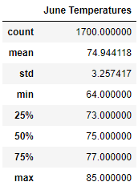
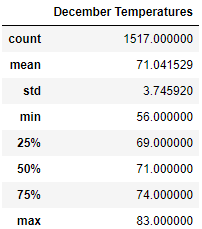
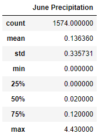
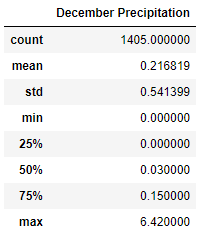

# Surf's Up

## Overview of Project

### Purpose
To analyze weather trends before opening a surf shop in Oahu to determine if the surf and ice cream shop business is sustainable year-round.

## Results
- Statistics for June demonstrate that the temperatures throughout the year ranges from 64-85 degrees, with an average temperature of 75 degrees.

- Statistics for December demonstrate that the temperatures throughout the year ranges from 56-83 degrees, with an average temperaure of 71 degrees.

- The average temperature between the 2 months is only different by 4 degrees and is in the 70's which is still warm enough to enjoy an ice cream cone and a day at the beach. Majority of the month should be good for business.

## Summary
- The average temperatures in June and December are 75 and 71 degrees respectively
- The average precipitation in June and December is 0.136 and 0.217 inches respectively

